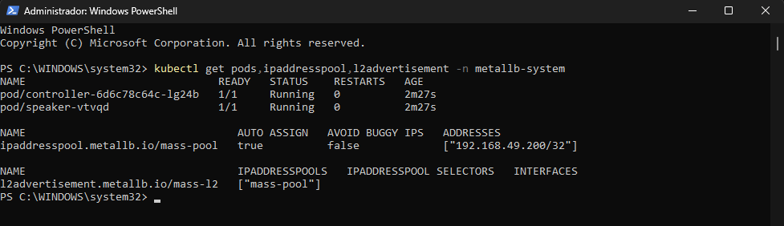
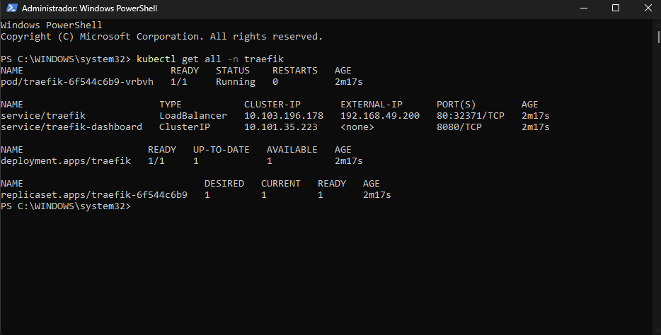
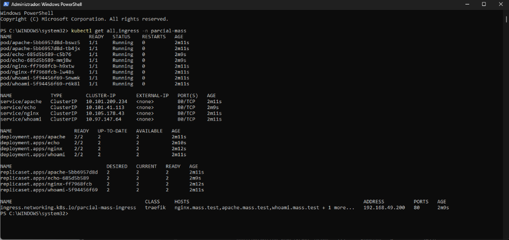
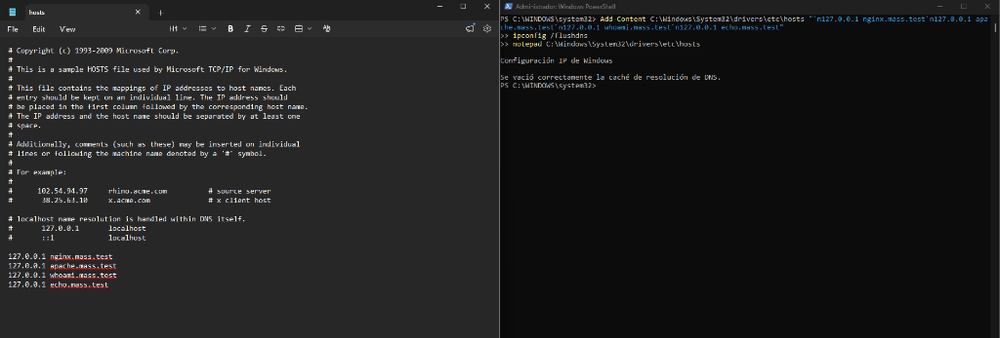
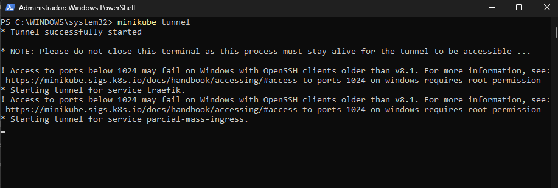
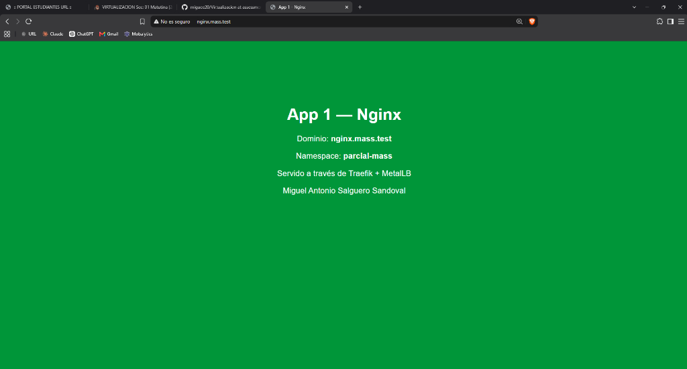
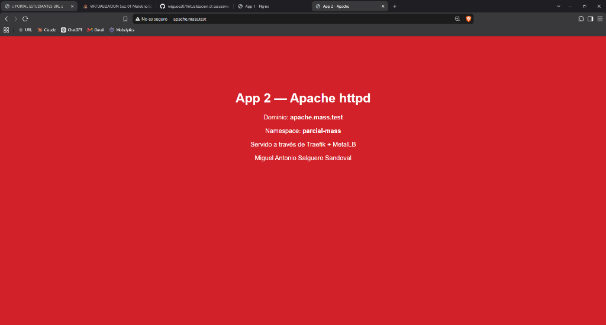
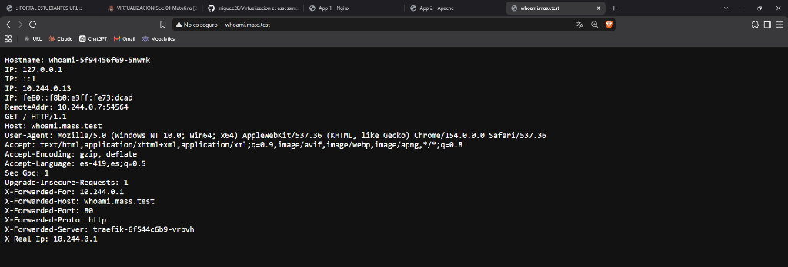
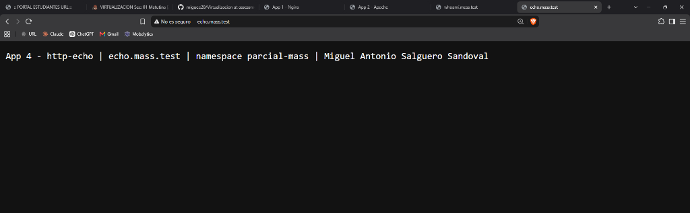

# Assessment II - Kubernetes, MetalLB and Traefik

**Student:** Miguel Antonio Salguero Sandoval

In this assessment I exposed 4 web applications running in Minikube through a single IP address, using MetalLB and Traefik.

## How it works

MetalLB gives a single IP (`192.168.49.200`) to the Traefik service, which is of type `LoadBalancer`. Every request enters the cluster through that IP and reaches Traefik. Traefik then looks at the domain name used in the request and sends it to the right application. For example, `nginx.mass.test` goes to the Nginx service and `echo.mass.test` goes to the Echo service.

To make the domain names work on my computer, I added them to the Windows `hosts` file.

## What was installed

- MetalLB, in the `metallb-system` namespace
- Traefik, in the `traefik` namespace
- 4 web apps (Nginx, Apache, Whoami and HTTP Echo), in the `parcial-mass` namespace

The namespace name comes from "parcial-" plus my initials (Miguel Antonio Salguero Sandoval = mass).

## Environment

- Windows 11 Home
- Minikube v1.39.0 with the Docker driver
- Docker network used by Minikube: `192.168.49.0/24`

## Repository files

All the configuration is written as YAML files:

- `metallb/` - MetalLB installation and its IP pool
- `traefik/` - Traefik namespace, permissions, deployment and service
- `apps/` - namespace, deployments, services and ingress for the 4 apps
- `images/` - screenshots

---

## Step 1 - Start Minikube

```powershell
minikube start --driver=docker
```

To choose the IP for MetalLB, I checked the network that Minikube uses in Docker:

```powershell
docker network inspect minikube --format '{{range .IPAM.Config}}{{.Subnet}}{{end}}'
minikube ip
```

The subnet is `192.168.49.0/24` and the node is `192.168.49.2`, so I picked `192.168.49.200` for MetalLB.

## Step 2 - Install MetalLB

I installed MetalLB from its official manifest, which lives in its own namespace (`metallb-system`):

```powershell
kubectl apply -f metallb/01-metallb-native.yaml
kubectl wait -n metallb-system --for=condition=ready pod -l app=metallb --timeout=180s
```

Then I told MetalLB which IP it can give out. Since I only need one IP, the pool has a single address (`/32`) - file `metallb/02-ipaddresspool.yaml`:

```yaml
apiVersion: metallb.io/v1beta1
kind: IPAddressPool
metadata:
  name: mass-pool
  namespace: metallb-system
spec:
  addresses:
    - 192.168.49.200/32
---
apiVersion: metallb.io/v1beta1
kind: L2Advertisement
metadata:
  name: mass-l2
  namespace: metallb-system
spec:
  ipAddressPools:
    - mass-pool
```

```powershell
kubectl apply -f metallb/02-ipaddresspool.yaml
kubectl get pods,ipaddresspool,l2advertisement -n metallb-system
```



## Step 3 - Install Traefik

Traefik was installed with plain YAML files (no Helm) in its own namespace (`traefik`). The files are:

- `00-namespace.yaml` - creates the `traefik` namespace
- `01-rbac.yaml` - permissions so Traefik can read services and ingresses
- `02-ingressclass.yaml` - the `traefik` ingress class
- `03-deployment.yaml` - the Traefik deployment
- `04-service.yaml` - the service of type `LoadBalancer`

The important part is the service. Because it is a `LoadBalancer`, MetalLB gives it the IP from the pool:

```yaml
apiVersion: v1
kind: Service
metadata:
  name: traefik
  namespace: traefik
  annotations:
    metallb.universe.tf/address-pool: mass-pool
spec:
  type: LoadBalancer
  selector:
    app: traefik
  ports:
    - name: web
      port: 80
      targetPort: web
```

```powershell
kubectl apply -f traefik/
kubectl rollout status -n traefik deploy/traefik
kubectl get all -n traefik
```

The `EXTERNAL-IP` of the Traefik service is `192.168.49.200`, so MetalLB is working:



## Step 4 - Create the 4 applications

The applications are in the `parcial-mass` namespace. Each one has a deployment with 2 replicas and a `ClusterIP` service:

- Nginx - image `nginx:1.27-alpine` - domain `nginx.mass.test`
- Apache - image `httpd:2.4-alpine` - domain `apache.mass.test`
- Whoami - image `traefik/whoami:v1.10` - domain `whoami.mass.test`
- HTTP Echo - image `hashicorp/http-echo:1.0` - domain `echo.mass.test`

Nginx and Apache show a custom HTML page that is loaded from a ConfigMap.

The services are not exposed directly. Traefik handles them through an Ingress that matches each domain name with its service (`apps/05-ingress.yaml`):

```yaml
apiVersion: networking.k8s.io/v1
kind: Ingress
metadata:
  name: parcial-mass-ingress
  namespace: parcial-mass
  annotations:
    traefik.ingress.kubernetes.io/router.entrypoints: web
spec:
  ingressClassName: traefik
  rules:
    - host: nginx.mass.test
      http:
        paths:
          - path: /
            pathType: Prefix
            backend:
              service:
                name: nginx
                port:
                  number: 80
    # the same rule is repeated for apache, whoami and echo
```

```powershell
kubectl apply -f apps/
kubectl get all,ingress -n parcial-mass
```

All pods are running and the Ingress shows the MetalLB IP as its address:



I also checked from inside Minikube that the MetalLB IP sends each domain to the right app:

```powershell
minikube ssh -- "curl -s -H 'Host: echo.mass.test' http://192.168.49.200/"
```

## Step 5 - Local DNS (hosts file)

On Windows, the equivalent of `/etc/hosts` is `C:\Windows\System32\drivers\etc\hosts`. I opened PowerShell as Administrator and added the 4 domains:

```powershell
Add-Content C:\Windows\System32\drivers\etc\hosts "`n127.0.0.1 nginx.mass.test`n127.0.0.1 apache.mass.test`n127.0.0.1 whoami.mass.test`n127.0.0.1 echo.mass.test"
ipconfig /flushdns
```



**Why 127.0.0.1 and not 192.168.49.200?**
I am using Windows 11 Home with the Docker driver, so Minikube runs inside Docker's own network. The MetalLB IP works inside that network, but Windows cannot reach it directly. To solve this I used `minikube tunnel`, which makes the Traefik LoadBalancer available on `127.0.0.1`. The 4 domains still go to the same Traefik LoadBalancer. On Linux, the hosts lines would use `192.168.49.200` instead.

## Step 6 - Minikube tunnel

I ran this in another PowerShell window as Administrator and left it open:

```powershell
minikube tunnel
```



## Step 7 - Access with the domain names

Nginx - http://nginx.mass.test



Apache - http://apache.mass.test



Whoami - http://whoami.mass.test (the `X-Forwarded-Server` header shows that the request went through Traefik)



Echo - http://echo.mass.test



## Run everything from scratch

```powershell
minikube start --driver=docker
kubectl apply -f metallb/01-metallb-native.yaml
kubectl wait -n metallb-system --for=condition=ready pod -l app=metallb --timeout=180s
kubectl apply -f metallb/02-ipaddresspool.yaml
kubectl apply -f traefik/
kubectl apply -f apps/
minikube tunnel
```
