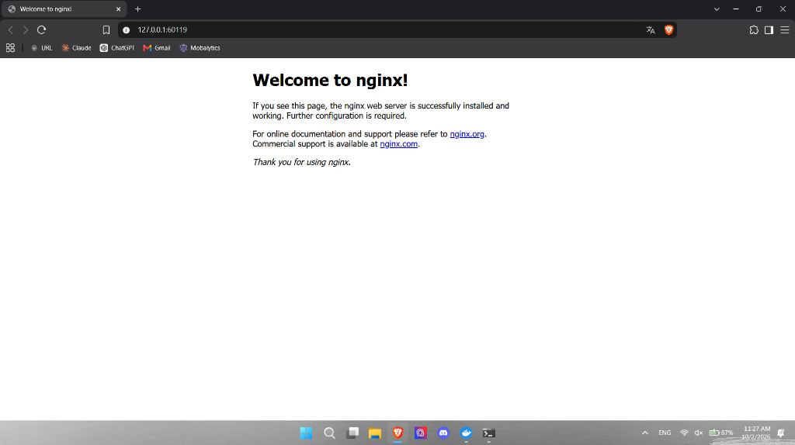

# Activity: Kubernetes Service Configuration

## 1. Browser Screenshot (Nginx Service)



## 2. Output of `kubectl get svc` command

```bash
NAME            TYPE        CLUSTER-IP    EXTERNAL-IP   PORT(S)        AGE
kubernetes      ClusterIP   10.96.0.1     <none>        443/TCP        37s
nginx-service   NodePort    10.99.13.76   <none>        80:31315/TCP   5s
```
