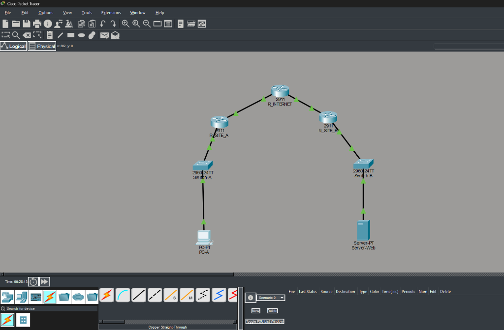
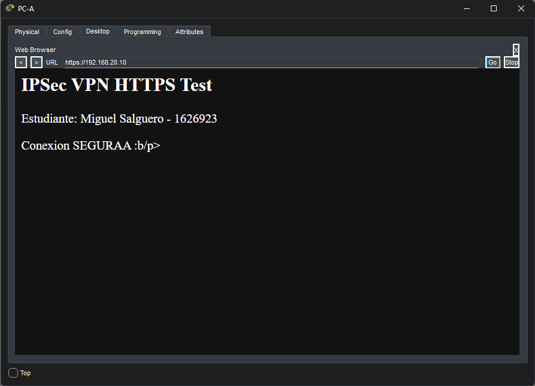
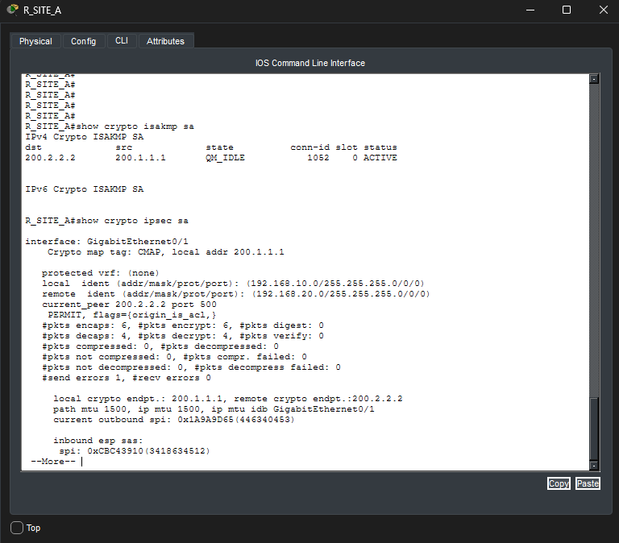

# Homework 04 - Site-to-Site IPSec VPN with HTTPS

**Student:** Miguel Antonio Salguero Sandoval - 1626923  
**Course:** Virtualization  

---

## 1. Network Topology

The topology consists of two distinct subnets (**Site A** and **Site B**) connected through a simulated **Internet (ISP)** router. A site-to-site **IPSec VPN in Tunnel Mode** was established between the edge routers (`R_SITE_A` and `R_SITE_B`) to enable secure, encrypted communication between both private networks.

---

## 2. IP Addressing

| Device | Interface | IP Address | Subnet Mask | Default Gateway |
| :--- | :--- | :--- | :--- | :--- |
| **PC-A** | FastEthernet0 | `192.168.10.10` | `255.255.255.0` (/24) | `192.168.10.1` |
| **R_SITE_A** | Gig0/0 (LAN A) | `192.168.10.1` | `255.255.255.0` (/24) | N/A |
| | Gig0/1 (WAN A) | `200.1.1.1` | `255.255.255.252` (/30) | N/A |
| **R_INTERNET** | Gig0/0 (WAN A) | `200.1.1.2` | `255.255.255.252` (/30) | N/A |
| | Gig0/1 (WAN B) | `200.2.2.1` | `255.255.255.252` (/30) | N/A |
| **R_SITE_B** | Gig0/1 (WAN B) | `200.2.2.2` | `255.255.255.252` (/30) | N/A |
| | Gig0/0 (LAN B) | `192.168.20.1` | `255.255.255.0` (/24) | N/A |
| **Server-Web** | FastEthernet0 | `192.168.20.10` | `255.255.255.0` (/24) | `192.168.20.1` |

---

## 3. HTTPS Web Service Request

HTTPS request performed from **PC-A** (`192.168.10.10`) to the Web Server at `https://192.168.20.10` across the IPSec VPN tunnel:

---

## 4. IPSec Tunnel Verification

Verification of active ISAKMP Phase 1 SA (`QM_IDLE`) and Phase 2 ESP encrypted/decapsulated packets:

---

## 5. Packet Tracer Topology File
- [hw04_ipsec.pkt](./hw04_ipsec.pkt)

