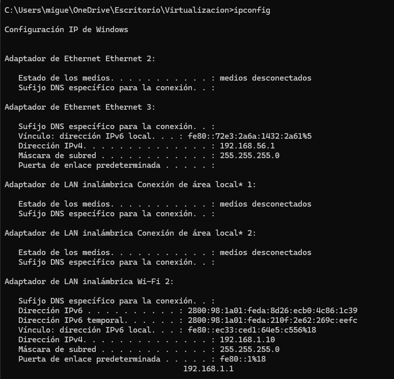
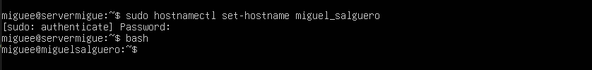
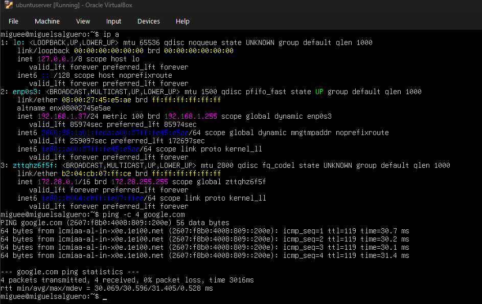
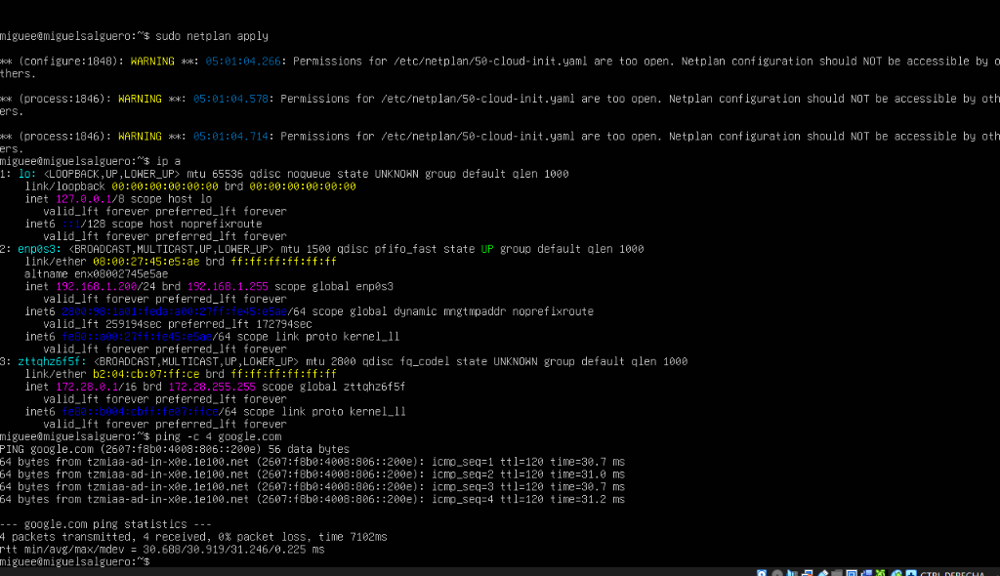
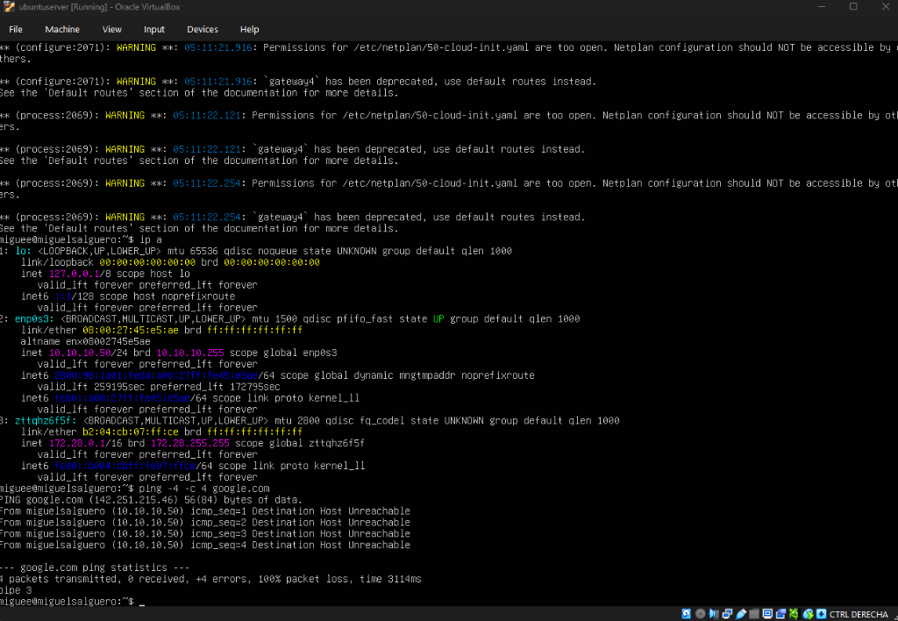

# Network Modes

**Student:** Miguel Antonio Salguero Sandoval - 1626923  
**Course:** Virtualization  

---

## Hypervisor Subnet

Host network configuration details obtained via `ipconfig` on Windows PowerShell:

- **Host IPv4:** `192.168.1.10`
- **Subnet Mask:** `255.255.255.0` (`/24`)
- **Default Gateway:** `192.168.1.1`
- **Hypervisor Subnet:** `192.168.1.0/24`



---

## Hostname Change

VM hostname updated using `hostnamectl`:

```bash
sudo hostnamectl set-hostname miguel_salguero
bash
```



---

## 1. DHCP

VM configured in **Bridge Mode** with dynamic IP assignment (DHCP):

- **Interface:** `enp0s3`
- **Assigned IP:** `192.168.1.37/24`
- **Connectivity:** `ping -c 4 google.com` successful (0% loss).



---

## 2. Static IP - Same Subnet

VM configured in **Bridge Mode** with a static IP within the hypervisor's subnet (`192.168.1.0/24`):

- **Assigned IP:** `192.168.1.200/24`
- **Gateway:** `192.168.1.1`
- **Connectivity:** `ping -c 4 google.com` successful (0% loss).



---

## 3. Static IP - Outside Subnet

VM configured in **Bridge Mode** with a static IP outside the hypervisor's subnet (`10.10.10.0/24`):

- **Assigned IP:** `10.10.10.50/24`
- **Connectivity:** `ping -4 -c 4 google.com` failed with `Destination Host Unreachable` (100% packet loss) as the IP cannot reach the default gateway.


