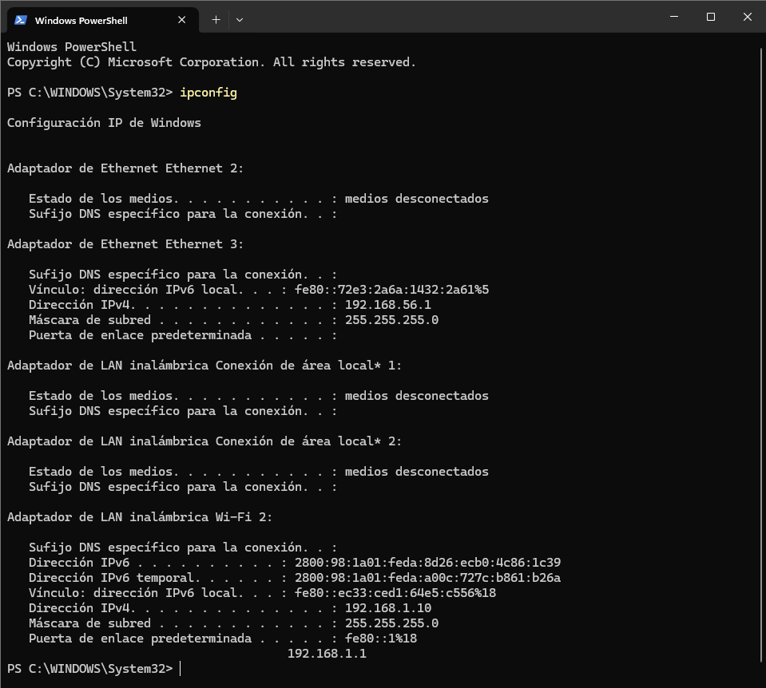
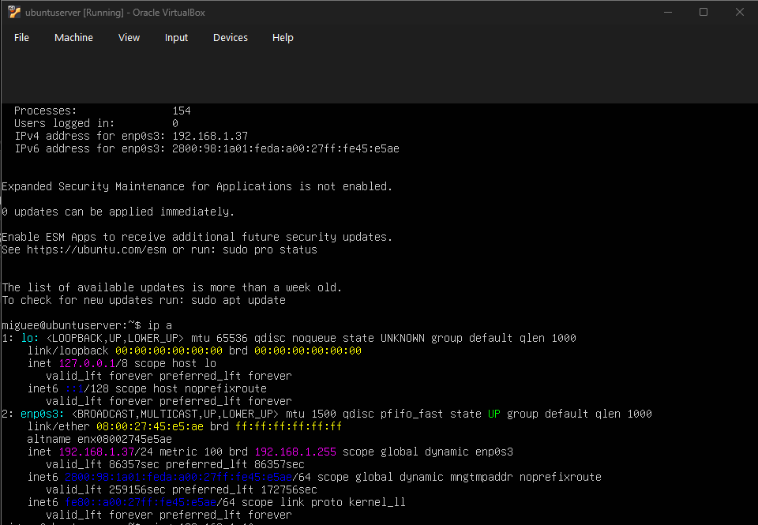
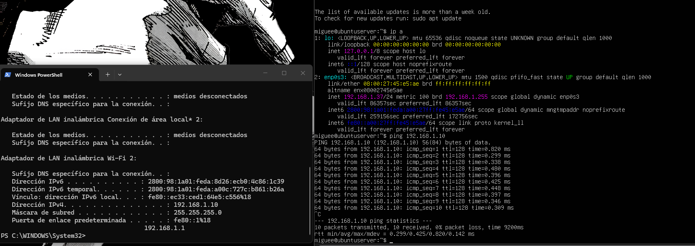

# Homework 1: Network Communication in VirtualBox

Miguel Antonio Salguero Sandoval 1626923
Evidences of network configuration between the host machine and the virtual server

## 1. Local Host Network Configuration

Network configuration and IP address of the host

## 2. Virtual Host Network Configuration

IP address of the virtual server (bridge adapter)

## 3. Successful Connection Test (Ping)

Successful response of the packages, from the virtual server to the host machine

